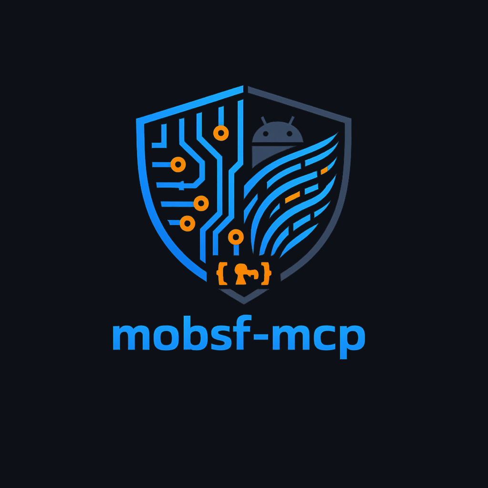

# mobsf-mcp

<p align="center">
  
</p>

An MCP (Model Context Protocol) server that gives AI agents the ability to perform autonomous Android security analysis — static analysis, dynamic analysis, and Frida instrumentation — powered by [MobSF](https://github.com/MobSF/Mobile-Security-Framework-MobSF).

Point your AI agent at an APK and let it autonomously discover vulnerabilities, inspect decompiled source, test exported activities, bypass SSL pinning with Frida, and generate security reports.

## Architecture

```
┌─────────────────────┐         ┌──────────────┐         ┌─────────────┐
│   AI Agent          │  MCP    │  mobsf-mcp   │  REST   │   MobSF     │
│ (Claude/Ollama/etc) │◄───────►│  Server      │◄───────►│  (Docker)   │
└─────────────────────┘  stdio  └──────────────┘  HTTP   └──────┬──────┘
                                                                 │ ADB
                                                          ┌──────▼──────┐
                                                          │  Android    │
                                                          │  Emulator   │
                                                          │ (optional)  │
                                                          └─────────────┘
```

**Static analysis** (no emulator needed): Upload APK → decompile → analyze manifest, permissions, code, secrets, network config, crypto, certificates, trackers.

**Dynamic analysis** (emulator required): Install app on emulator → monitor runtime behavior → intercept API calls with Frida → test TLS → collect network traffic → exported activity testing.

## Quick Start

### One-command setup

```bash
bash scripts/setup.sh
```

### Or step-by-step

```bash
# 1. Start MobSF
docker compose up -d

# 2. Get the API key
docker logs mobsf 2>&1 | grep "REST API Key"

# 3. Install the MCP server
pip install -e .

# 4. Configure
cp .env.example .env
# Edit .env with your API key

# 5. Use with your MCP client
mobsf-mcp
```

## Connecting to Your LLM

Once MobSF is running and the MCP server is installed, configure your MCP client to load the tools.

### Claude Desktop

Add to `~/.claude/claude_desktop_config.json`:

```json
{
  "mcpServers": {
    "mobsf": {
      "command": "mobsf-mcp",
      "env": {
        "MOBSF_URL": "http://localhost:8000",
        "MOBSF_API_KEY": "your_api_key_here"
      }
    }
  }
}
```

Restart Claude Desktop. The 23 tools appear automatically.

### Open WebUI + Ollama

See [docs/ollama-setup.md](docs/ollama-setup.md) for connecting local LLMs via mcpo bridge.

### Any MCP Client

The server speaks stdio MCP. Point any MCP-compatible client at the `mobsf-mcp` command with `MOBSF_URL` and `MOBSF_API_KEY` environment variables. No additional configuration needed.

```bash
# Test standalone
MOBSF_URL=http://localhost:8000 MOBSF_API_KEY=your_key mobsf-mcp
```

## Available Tools (23)

### Static Analysis (8)
| Tool | Description |
|------|-------------|
| `upload_apk` | Upload an APK file for analysis |
| `scan_apk` | Trigger static analysis (decompile, manifest, code, secrets) |
| `get_report` | Get detailed security findings (filterable by section) |
| `get_security_scorecard` | High-level security posture score |
| `view_source_file` | Inspect specific decompiled source files |
| `list_scans` | List all previous scans |
| `search_scans` | Search scans by name/package/hash |
| `delete_scan` | Remove a scan |

### Dynamic Analysis (9)
| Tool | Description |
|------|-------------|
| `list_dynamic_apps` | List apps ready for dynamic testing |
| `start_dynamic_analysis` | Install & launch app on emulator |
| `stop_dynamic_analysis` | Stop analysis & collect results |
| `get_dynamic_report` | Get runtime analysis findings |
| `get_logcat` | Get filtered logcat output |
| `run_adb_command` | Execute ADB commands on device |
| `test_exported_activities` | Test for unauthorized activity access |
| `launch_activity` | Launch a specific activity |
| `run_tls_tests` | Test TLS/SSL security |

### Frida Instrumentation (6)
| Tool | Description |
|------|-------------|
| `frida_instrument` | Run hooks (SSL bypass, root bypass, custom scripts) |
| `frida_monitor_apis` | Monitor sensitive API calls at runtime |
| `frida_get_logs` | Get Frida hook output |
| `frida_list_scripts` | List available built-in scripts |
| `frida_get_script_code` | View script source code |
| `frida_get_dependencies` | Install Frida dependencies on device |

## Dynamic Analysis Setup

Dynamic analysis requires an Android emulator with **root access** (for writable `/system`) connected to MobSF.

> **Note on API level:** MobSF v4.5.1 uses Frida 17.15.3 which has a known compatibility issue with Android 13 (API 33) — `frida.attach()` crashes with a `TypeError`. For full DAST including Frida instrumentation, use an Android 11 (API 30) emulator. ADB commands, exported activity testing, TLS tests, and logcat all work fine on API 33. This will be resolved when MobSF updates its Frida dependency.

### Emulator Setup

```bash
# Install Android SDK command-line tools, then:
sdkmanager "system-images;android-33;google_apis;x86_64" "platforms;android-33" "platform-tools"
avdmanager create avd -n mobsf -k "system-images;android-33;google_apis;x86_64" -d pixel_6 -f

# Start with writable system
emulator -avd mobsf -no-window -no-audio -no-snapshot \
    -writable-system -gpu swiftshader_indirect -memory 2048 &

# Wait for boot
adb wait-for-device
adb root && adb remount
adb shell 'while [[ -z $(getprop sys.boot_completed) ]]; do sleep 5; done'
```

### Docker ↔ Emulator Wiring

This project's `docker-compose.yml` is pre-configured:

- `network_mode: host` — Docker shares the host network, so ADB just works
- `MOBSF_PLATFORM=host` — disables Docker Desktop hostname translation
- `ANALYZER_IDENTIFIER=emulator-5554` — points MobSF to the emulator
- `./mobsf-data/.android/` — ADB keys mounted for authorization
- Entrypoint wrapper patches MobSF to support API 33+

**Important**: Kill the host ADB server before starting MobSF Docker to avoid ADB conflicts:

```bash
adb kill-server && docker compose up -d
```

## Example Agent Interaction

```
User: Analyze the security of ./target.apk

Agent: I'll upload and scan this APK for you.
       [calls upload_apk("./target.apk")]
       [calls scan_apk("a1b2c3d4...")]
       [calls get_security_scorecard("a1b2c3d4...")]

       The app has a security score of 28/100 (High Risk):
       - 6 high-severity manifest issues (StrandHogg 2.0, debuggable)
       - 7 exported components without permission checks
       - Janus vulnerability (v1 signature only)
       - 23 hardcoded secrets found
       - 3 privacy trackers
       - Debug enabled, backup allowed

       Want me to start dynamic analysis and test the exported activities?
```

## File Structure

```
/home/kali/labs/MCP/
├── src/
│   ├── server.py          ← MCP server (23 tools)
│   └── mobsf_client.py    ← MobSF REST API client
├── scripts/
│   ├── setup.sh           ← One-command setup
│   └── test_pipeline.py   ← End-to-end test suite
├── docs/
│   └── ollama-setup.md    ← LLM integration guide
├── mobsf-data/            ← Docker volume (persistent)
│   ├── .android/adbkey    ← ADB authorization keys
│   ├── entrypoint-wrapper.sh ← API cap patch
│   ├── config.py / db.sqlite3 / secret
│   └── downloads/         ← Scan artifacts
├── tests/
│   └── test.apk           ← InsecureBankv2 (test target)
├── docker-compose.yml     ← MobSF container config
├── pyproject.toml         ← Python package config
├── .env.example           ← Environment template
└── README.md
```

## Development

```bash
pip install -e .
python3 scripts/test_pipeline.py
```

## License

MIT
